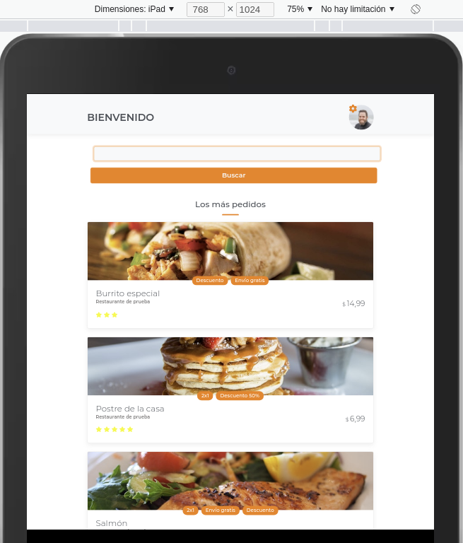

# Mi App de Ordenes

Este es un proyecto final para el curso
> **Git y GitHub: Control de versiones en Proyectos Web**

ofrecido por la plataforma [Crehana](https://www.crehana.com/clases/v2/9356/proyecto/)

---
El resultado consta del diseño de pantalla de una app movil para ordenar pedidos de productos alimenticios.

Se compone de:
+ __Encabezado con avatar de usuario y menú inicial__
+ __Barra de búsqueda__
+ __Catálogo de productos a ordenar__ 

---

